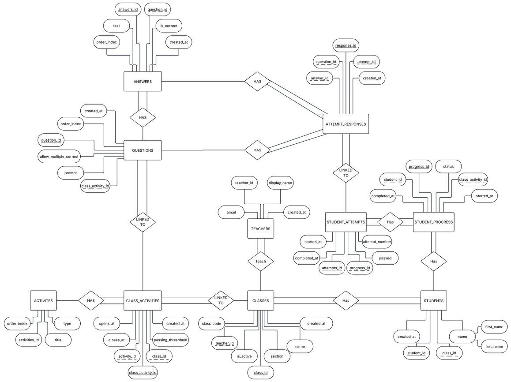

# ⚗️ ChemClicks

> *Chemistry education, one click at a time.*


---

## 📖 Synopsis

**ChemClicks** is an interactive chemistry education web application built for students and instructors at the college level. The platform allows students to explore chemical concepts through click-driven modules — bridging the gap between passive reading and hands-on lab work. Instructors can assign modules, track progress, and assess understanding through built-in quizzes and simulations.

ChemClicks is developed as a senior capstone project at **California State University, Sacramento** for **CSC 190/191**.

---

## 🖼️ Screenshots & Prototypes

> *Prototype images and wireframes will be added here upon completion of the UI design phase.*

| View | Preview |
|------|---------|
| Landing Page | (public/mockups/landing.png) *(placeholder)* |
| Student Dashboard | `public/mockups/dashboard.png` *(placeholder)* |
| Quiz Module | `public/mockups/quiz.png` *(placeholder)* |
| Instructor View | `public/mockups/instructor.png` *(placeholder)* |

---

## 🗂️ Entity Relationship Diagram



**Tables:** `STUDENTS` · `TEACHERS` · `CLASSES` · `CLASS_ACTIVITIES` · `ACTIVITES` · `QUESTIONS` · `ANSWERS` · `STUDENT_ATTEMPTS` · `ATTEMPT_RESPONSES` · `STUDENT_PROGRESS`

Key relationships:
- **Teachers** teach **Classes**, which have **Class Activities** linked to **Activities**
- **Students** belong to **Classes** and track progress via **Student Progress**
- **Student Attempts** log each quiz attempt and link to **Attempt Responses**
- **Questions** have **Answers** (supporting multiple correct answers via `allow_multiple_correct`)

---

## 🛠️ Tech Stack

| Layer | Technology |
|-------|-----------|
| Framework | [Next.js 15](https://nextjs.org/) (App Router) |
| Language | TypeScript |
| Styling | Tailwind CSS |
| Database | Supabase (PostgreSQL) |
| Auth | Supabase Auth |
| Linting | ESLint |
| Package Manager | npm |

---

## 🚀 Developer Instructions

### Prerequisites

- **Node.js** v18+
- **npm** v9+
- A [Supabase](https://supabase.com) project (free tier works)

### Local Setup

```bash
# 1. Clone the repository
git clone https://github.com/DerickT02/chemclicks.git
cd chemclicks

# 2. Install dependencies
npm install

# 3. Set up environment variables
cp .env.example .env.local
# Fill in your Supabase URL and anon key in .env.local

# 4. Run the development server
npm run dev
```

Open [http://localhost:3000](http://localhost:3000) in your browser.

### Environment Variables

```env
NEXT_PUBLIC_SUPABASE_URL=your_supabase_project_url
NEXT_PUBLIC_SUPABASE_ANON_KEY=your_supabase_anon_key
```

### Branch Strategy

| Branch | Purpose |
|--------|---------|
| `main` | Stable, production-ready code |
| `dev` | Active integration branch |
| `feat/<name>` | Feature branches off `dev` |

#### Workflow

```bash
# Start a new feature
git checkout dev
git pull origin dev
git checkout -b feat/your-feature-name

# Commit often with semantic messages
git add .
git commit -m "feat: add quiz submission handler"
git push -u origin feat/your-feature-name

# Keep your branch up to date with dev
git fetch origin
git merge origin/dev

# Open a pull request → dev when complete
```

**Commit message format:** `<type>: <short description>`
Types: `feat`, `fix`, `chore`, `docs`, `refactor`, `test`

---

## 🧪 Testing

> *This section will be completed in CSC 191.*

Planned testing strategy:

- **Unit Tests** — Component-level logic using [Jest](https://jestjs.io/) + [React Testing Library](https://testing-library.com/)
- **Integration Tests** — API routes and Supabase interactions
- **End-to-End Tests** — Full user flows using [Playwright](https://playwright.dev/)

```bash
# Run unit tests (CSC 191)
npm run test

# Run e2e tests (CSC 191)
npm run test:e2e
```

---

## 📦 Deployment

> *This section will be completed in CSC 191.*

Planned deployment pipeline:

- **Hosting:** [Vercel](https://vercel.com) (Next.js native)
- **Database:** Supabase hosted PostgreSQL
- **CI/CD:** GitHub Actions → auto-deploy on merge to `main`

```bash
# Build for production (CSC 191)
npm run build
npm run start
```

---

## 📅 Project Timeline & Milestones

> Planned for CSC 191 — continued Scrum development with 2-week sprints.

### ⚛️ Sprint 5 — Bohr Model Learning Modules
**Status:** 🔜 Planned

| Story | Description |
|-------|-------------|
| Bohr model introduction | Build an interactive Bohr model builder for the first 20 elements, from Hydrogen through Calcium |
| Element picker | Allow students to select an element and automatically generate the correct electron shell layout |
| Shell visualization | Render concentric electron shells with glowing electron dots and a labeled nucleus |
| Stability explorer | Add an interactive panel where students adjust protons and electrons to explore atomic stability |
| Charge calculation | Display noble-gas stability, neutral-charge stability, and overall ionic charge |
| Bohr model quiz | Add a quiz at the end of the Bohr Models section that must be completed before moving forward |

---

### 🧪 Sprint 6 — Lewis Diagrams & Chemical Bonding
**Status:** 🔜 Planned

| Story | Description |
|-------|-------------|
| Lewis dot diagrams | Build a Lewis diagram module showing valence electrons for the first 20 elements |
| Mini Bohr comparison | Display a mini Bohr model next to the Lewis dot diagram for the selected element |
| Covalent compounds | Add interactive visualizations for compounds such as H₂, O₂, N₂, HF, H₂O, CO₂, NH₃, and CH₄ |
| Bond visualization | Show single, double, and triple bonds using shared electron-pair diagrams |
| Ionic compounds | Add ionic compound examples such as NaCl, MgO, CaF₂, and Al₂O₃ |
| Charge balancing | Show how cations and anions combine to create neutral ionic compounds |
| Lewis structures quiz | Add a quiz at the end of the Lewis Structures section that must be completed before moving forward |

---

### 📏 Sprint 7 — Measurement Uncertainty Lab
**Status:** 🔜 Planned

| Story | Description |
|-------|-------------|
| Ruler simulation | Build an interactive ruler with tick marks from 0 to 10 and a draggable cursor |
| Tenths-place measurement | Display live ruler measurements rounded to the tenths place |
| Hundredths-place measurement | Add a finer ruler mode for measurements rounded to the hundredths place |
| Graduated cylinder simulation | Build a vertical graduated cylinder with a draggable water level |
| Meniscus visualization | Display a curved meniscus and volume readout in milliliters |
| Measurement quiz | Add a quiz where students estimate measurements using rulers and graduated cylinders |
| Feedback pop-ups | Display immediate feedback such as “Correct!” or retry prompts after quiz answers |

---

### 🧑‍🏫 Sprint 8 — Classroom Management & Student Progress
**Status:** 🔜 Planned

| Story | Description |
|-------|-------------|
| Class list page | Display all teacher-created classes in a scrollable list |
| Class details | Show class name, student count, class login code, and active students |
| Add class form | Allow teachers to create classes with unique names and 6-digit class codes |
| Code generation | Support manual and automatic generation of unique class codes |
| Student progress tracking | Show where each student is in the lesson sequence |
| Remove class flow | Add class deletion with a confirmation pop-up before removal |
| Progress persistence | Store and update student progress as students complete learning modules and quizzes |

---

### 🧰 Sprint 9 — Testing, Deployment & Final Delivery
**Status:** 🔜 Planned

| Story | Description |
|-------|-------------|
| Authentication errors | Add pop-ups for username not found, incorrect password, invalid class code, and invalid signup credentials |
| Forgot password flow | Add teacher password reset support through email |
| Unit tests | Add tests for components, utility functions, and quiz logic |
| Integration tests | Test Supabase interactions, authentication flows, and student attempt submissions |
| End-to-end tests | Add Playwright tests for major student and teacher workflows |
| Accessibility review | Improve keyboard navigation, labels, and readability across interactive modules |
| Production deployment | Deploy the application to a cloud-hosted environment |
| Supabase production setup | Finalize hosted PostgreSQL tables, authentication, and environment variables |
| Documentation updates | Update setup instructions, environment variable notes, and developer documentation |
| Final demo preparation | Prepare demo materials showing the student and teacher workflows |
| Product handoff | Deliver the source code, documentation, and deployed application to the product owner |

---


## 📚 Resources

| Resource | Link |
|----------|------|
| General Docs | [devdocs.io](https://devdocs.io/) |
| JavaScript Basics | [javascript.info](https://javascript.info/) |
| TypeScript Docs | [typescriptlang.org/docs](https://www.typescriptlang.org/docs/) |
| Next.js Docs | [nextjs.org/docs](https://nextjs.org/docs) |
| Tailwind Docs | [tailwindcss.com/docs](https://tailwindcss.com/docs) |
| Supabase Docs | [supabase.com/docs](https://supabase.com/docs) |

---


## 📄 License

This project is licensed under the MIT License. See [`LICENSE`](./LICENSE) for details.

---

<p align="center">
  Built with ☕ and too many chemistry puns at Sacramento State
</p>
